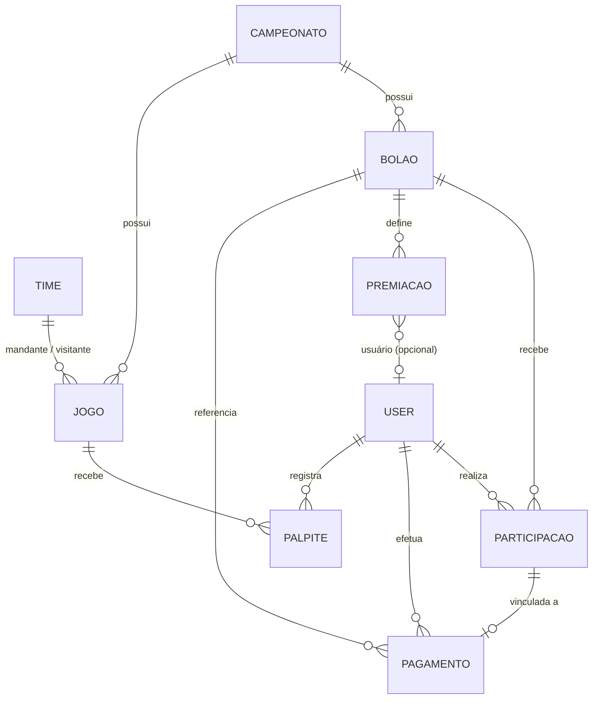

# Palpitou API


API REST em Java/Spring Boot para uma plataforma de **bolão de futebol**: campeonatos, jogos, bolões, participação mediante pagamento via PIX, palpites, pontuação, ranking, premiações e métricas administrativas.

O projeto modela o ciclo de um produto real, em que o usuário paga para entrar, o pagamento é validado, os palpites são feitos antes da partida e a pontuação é calculada a partir do resultado. Ele não é um CRUD isolado.

> **Estágio atual:** back-end em desenvolvimento ativo. A API REST principal, as regras de negócio iniciais, a pontuação, o tratamento global de exceções e os testes unitários dos principais serviços estão implementados. Autenticação/autorização, endpoint do Dashboard, PostgreSQL, Docker e front-end ainda **não** estão implementados (veja o [Roadmap](#roadmap)).

---

## Índice

- [Escopo do produto](#escopo-do-produto)
- [Stack](#stack)
- [Arquitetura](#arquitetura)
- [Domínio](#domínio)
- [Regras de negócio](#regras-de-negócio)
- [Sistema de pontuação](#sistema-de-pontuação)
- [Participações e pagamentos](#participações-e-pagamentos)
- [Premiações](#premiações)
- [Dashboard](#dashboard)
- [Tratamento de exceções](#tratamento-de-exceções)
- [Segurança](#segurança)
- [Endpoints](#endpoints)
- [Exemplos de requisição](#exemplos-de-requisição)
- [Documentação da API (Swagger)](#documentação-da-api-swagger)
- [Banco de dados](#banco-de-dados)
- [Como executar](#como-executar)
- [Testes](#testes)
- [Estrutura do projeto](#estrutura-do-projeto)
- [Decisões técnicas](#decisões-técnicas)
- [Roadmap](#roadmap)
- [Autor](#autor)

---

## Escopo do produto

O Palpitou foi pensado para bolões de campeonatos como o **Campeonato Brasileiro** e o **Campeonato Paulista**. O modelo de campeonato é genérico (nome, temporada e status), então não há nenhum campeonato fixo no código.

O fluxo de negócio coberto pela modelagem e pelos serviços é:

1. um administrador cadastra campeonato, times, jogos e bolões;
2. o usuário registra um pagamento (PIX) para um bolão;
3. o pagamento é aprovado (status alterado via API);
4. com o pagamento aprovado, a participação no bolão pode ser criada;
5. o usuário registra palpites para os jogos antes do início da partida;
6. com o resultado do jogo registrado, a pontuação é calculada por regras definidas no `PontuacaoService`.

---

## Stack

| Categoria | Tecnologia |
| --- | --- |
| Linguagem | Java 17 |
| Framework | Spring Boot 4.1.0 |
| API REST | Spring Web MVC |
| Persistência | Spring Data JPA / Hibernate |
| Validação | Jakarta Bean Validation |
| Segurança | Spring Security (configuração inicial) |
| Banco de dados | H2 (em memória, desenvolvimento) |
| Documentação | Springdoc OpenAPI / Swagger UI |
| Produtividade | Lombok |
| Build | Maven (Maven Wrapper incluso) |
| Versionamento | Git / GitHub |

---

## Arquitetura

Arquitetura em camadas, com responsabilidades separadas:

Controller → Service → Repository → Database
↑ ↑
DTO Mapper / Entity


| Camada | Responsabilidade |
| --- | --- |
| **Controller** | Expõe os endpoints REST, recebe DTOs de entrada e devolve DTOs de resposta. Delega o processamento aos services. |
| **Service** | Concentra as regras de negócio (validações, cálculo de pontuação, agregações do dashboard). |
| **Repository** | Acesso a dados com Spring Data JPA, incluindo consultas derivadas e uma consulta JPQL de agregação. |
| **DTO** | Contrato de entrada e saída da API, separado das entidades. Organizado em `request`, `response`, `putRequest`, `putResponse` e `Dashboard`. |
| **Mapper** | Conversão entre entidades e DTOs (classes `@Component` escritas manualmente). |
| **Entity** | Mapeamento JPA/Hibernate do domínio. |
| **Exception** | `ResourceNotFoundException`, `BusinessRuleException` e `GlobalExceptionHandler`. |
| **Security** | `SecurityConfig` com a configuração inicial do Spring Security. |

---

## Domínio

Entidades: `User`, `Campeonato`, `Bolao`, `Jogo`, `Time`, `Participacao`, `Pagamento`, `Palpite` e `Premiacao`.

| Entidade | Responsabilidade |
| --- | --- |
| `User` | Usuário da plataforma (nome, e-mail único, senha, `Role`: `ADMIN` ou `USER`). |
| `Campeonato` | Competição (nome, temporada, status). |
| `Bolao` | Bolão vinculado a um campeonato (nome, valor de inscrição, período e status). |
| `Jogo` | Partida de um campeonato (data/hora, rodada, placar, status, mandante e visitante). |
| `Time` | Time (nome, sigla, escudo). |
| `Pagamento` | Pagamento PIX de um usuário para um bolão. |
| `Participacao` | Participação de um usuário em um bolão, vinculada a um pagamento. |
| `Palpite` | Previsão de placar de um usuário para um jogo, com pontos obtidos. |
| `Premiacao` | Prêmio configurado para uma posição de um bolão. |

Relacionamentos presentes no código:



---

## Regras de negócio

Regras implementadas hoje nos services:

| Contexto | Regra | Resposta em caso de violação |
| --- | --- | --- |
| Participação | Um usuário não pode participar duas vezes do mesmo bolão. | `409 Conflict` |
| Participação | Somente pagamento com status `APROVADO` permite criar a participação. | `409 Conflict` |
| Participação | Bolão cuja data de início já passou não aceita novas participações. | `409 Conflict` |
| Palpite | Um usuário não pode ter mais de um palpite para o mesmo jogo. | `409 Conflict` |
| Palpite | Não é possível palpitar após o início do jogo. | `409 Conflict` |
| Bolão | Não é permitido cadastrar bolão com status `FINALIZADA`. | `409 Conflict` |
| Jogo | Não é permitido cadastrar jogo em campeonato `FINALIZADA`. | `409 Conflict` |
| Jogo | Mandante e visitante não podem ser o mesmo time. | `409 Conflict` |
| Dashboard | O faturamento considera apenas pagamentos `APROVADO`. | n/a |

**Estados existentes**

| Enum | Valores |
| --- | --- |
| `StatusPagamento` | `PENDENTE`, `APROVADO`, `RECUSADO` |
| `StatusParticipacao` | `PENDENTE`, `APROVADA`, `REJEITADA` |
| `StatusGlobal` (campeonato, bolão e jogo) | `ABERTA`, `EM_ANDAMENTO`, `FINALIZADA` |
| `Role` | `ADMIN`, `USER` |

---

## Sistema de pontuação

O cálculo está em `PontuacaoService`, comparando o placar do jogo com o palpite:

| Situação | Pontos |
| --- | --- |
| Placar exato | 10 |
| Vencedor correto **e** gols do vencedor corretos | 7 |
| Vencedor correto | 5 |
| Empate previsto corretamente (placar diferente do exato) | 5 |
| Resultado incorreto | 0 |

Exemplo com o resultado **Flamengo 2 x 1 Palmeiras**:

| Palpite | Pontos | Motivo |
| --- | --- | --- |
| 2 x 1 | 10 | placar exato |
| 2 x 0 | 7 | mandante venceu e os gols do mandante conferem |
| 3 x 1 | 7 | mandante venceu e os gols do visitante conferem |
| 3 x 0 | 5 | apenas o vencedor confere |
| 1 x 1 | 0 | resultado incorreto |

Observe que, no código atual, os 7 pontos exigem que os gols do **time vencedor** estejam corretos (o campo "gols do perdedor" não entra nessa regra).

O `PontuacaoService` também oferece:

- busca de palpites de uma rodada e de um usuário em uma rodada;
- identificação dos participantes de uma rodada;
- soma da pontuação por participante na rodada;
- geração do ranking da rodada (`RankingResponse` com posição, nome e pontuação).

> Esses métodos estão implementados na camada de serviço e cobertos por testes. **Ainda não há endpoint REST** que exponha o ranking.

---

## Participações e pagamentos

Fluxo conceitual:

Usuário → registra pagamento (PENDENTE) → pagamento aprovado
→ cria participação (PENDENTE) → participação aprovada
→ participa do bolão


**Pagamento** (`/pagamentos`)
- Campos: valor, nome do pagador PIX, comprovante, usuário e bolão, além do status.
- Todo pagamento é criado com status `PENDENTE`.
- A atualização (`PUT /pagamentos/{id}`) altera apenas o status.
- O `comprovante` é um campo de texto. **Não existe upload nem armazenamento de arquivos.**

**Participação** (`/participacoes`)
- A criação exige usuário, bolão e um pagamento já com status `APROVADO`.
- A participação é criada com status `PENDENTE` e a data de inscrição é preenchida automaticamente.
- A atualização (`PUT /participacoes/{id}`) altera pontos e status (`PENDENTE`, `APROVADA`, `REJEITADA`).
- Não há uma regra de aprovação automática: a mudança de status acontece pela atualização.

---

## Premiações

Cada premiação possui **posição**, **valor**, **descrição** e o **bolão** relacionado. A entidade também tem um campo opcional de usuário, retornado como `userId` na resposta.

Já é possível cadastrar, consultar, listar e excluir premiações. A **apuração automática** (definir o vencedor de cada posição a partir do ranking) e a distribuição de prêmios **ainda não estão implementadas**. Hoje o `userId` fica vazio, pois nenhum fluxo o preenche.

---

## Dashboard

**Estrutura inicial, em desenvolvimento.**

O `DashboardService` já calcula:

| Métrica | Critério |
| --- | --- |
| Total de bolões | contagem de bolões |
| Participantes aprovados | participações com status `APROVADA` |
| Pagamentos pendentes | pagamentos `PENDENTE` |
| Pagamentos aprovados | pagamentos `APROVADO` |
| Pagamentos recusados | pagamentos `RECUSADO` |
| Faturamento | soma dos valores de pagamentos `APROVADO` |

As métricas vêm de **consultas de agregação no banco** (`COUNT` por status e `SELECT COALESCE(SUM(p.valor), 0)` em JPQL). Isso evita carregar todas as entidades em memória apenas para contar ou somar.

O `DashboardService` e as consultas de agregação já estão implementados. A exposição via endpoint REST está em desenvolvimento: o `DashboardController` existe mapeado em `/dashboard`, mas ainda não possui nenhum método.

---

## Tratamento de exceções

O `GlobalExceptionHandler` (`@RestControllerAdvice`) centraliza o mapeamento de exceções de domínio para respostas HTTP:

| Exceção | HTTP |
| --- | --- |
| `ResourceNotFoundException` | `404 Not Found` |
| `BusinessRuleException` | `409 Conflict` |

O corpo da resposta é a mensagem de erro em texto. O benefício é manter os services focados na regra de negócio, com um único ponto de tradução para HTTP. Ainda **não há** tratamento dedicado para erros de validação.

---

## Segurança

| Item | Situação |
| --- | --- |
| Configuração inicial do Spring Security (`SecurityConfig`) | Implementado |
| Autenticação | Em desenvolvimento |
| Autorização / controle de acesso por perfil | Em desenvolvimento |
| JWT | Planejado |
| Proteção definitiva dos endpoints | Em desenvolvimento |

Atualmente o `SecurityConfig` desabilita CSRF e **libera todas as requisições** (`anyRequest().permitAll()`). Portanto **não há proteção de acesso** nos endpoints, e a senha do usuário ainda é armazenada como recebida na API. Não utilize a aplicação em ambiente público no estado atual.

---

## Endpoints

| Recurso | Base | Operações |
| --- | --- | --- |
| Campeonatos | `/campeonatos` | `GET`, `GET /{id}`, `POST`, `PUT /{id}`, `DELETE /{id}` |
| Bolões | `/boloes` | `GET`, `GET /{id}`, `POST`, `PUT /{id}`, `DELETE /{id}` |
| Jogos | `/jogos` | `GET`, `GET /{id}`, `POST`, `PUT /{id}`, `DELETE /{id}` |
| Times | `/times` | `GET`, `GET /{id}`, `POST`, `PUT /{id}`, `DELETE /{id}` |
| Usuários | `/users` | `GET`, `GET /{id}`, `POST`, `PUT /{id}/Me`, `PUT /{id}/Role`, `DELETE /{id}` |
| Pagamentos | `/pagamentos` | `GET`, `GET /{id}`, `POST`, `PUT /{id}`, `DELETE /{id}` |
| Participações | `/participacoes` | `GET`, `GET /{id}`, `POST`, `PUT /{id}`, `DELETE /{id}` |
| Palpites | `/palpites` | `GET`, `GET /{id}`, `POST`, `PUT /{id}`, `DELETE /{id}` |
| Premiações | `/premiacao` | `GET`, `GET /{id}`, `POST`, `DELETE /{id}` |

Os identificadores são `Long`. Ainda **não existem** endpoints para o Dashboard nem para o ranking.

---

## Exemplos de requisição

Os corpos abaixo seguem os DTOs reais do projeto. Datas usam o formato ISO-8601 (`LocalDateTime`).

**Criar bolão** — `POST /boloes`

```json
{
  "nome": "Bolão Brasileirão Rodada 10",
  "valorInscricao": 30.00,
  "dataInicio": "2026-10-10T16:00:00",
  "dataFim": "2026-10-17T22:00:00",
  "status": "ABERTA",
  "campeonatoId": 1
}
```

**Registrar pagamento** — `POST /pagamentos`

```json
{
  "valor": 30.00,
  "nomePagadorPix": "Maria Silva",
  "comprovante": "comprovante-pix-123",
  "userId": 1,
  "bolaoId": 1
}
```

Resposta (o pagamento nasce `PENDENTE`):

```json
{
  "valor": 30.00,
  "status": "PENDENTE",
  "nomePagadorPix": "Maria Silva",
  "comprovante": "comprovante-pix-123"
}
```

**Aprovar pagamento** — `PUT /pagamentos/{id}`

```json
{ "status": "APROVADO" }
```

**Criar participação** (exige pagamento aprovado) — `POST /participacoes`

```json
{
  "pontos": 0,
  "userId": 1,
  "bolaoId": 1,
  "pagamentoId": 1
}
```

**Registrar palpite** — `POST /palpites`

```json
{
  "golsMandante": 2,
  "golsVisitante": 1,
  "jogoId": 1,
  "userId": 1
}
```

**Cadastrar premiação** — `POST /premiacao`

```json
{
  "posicao": 1,
  "valor": 500.00,
  "descricao": "Prêmio do 1º colocado",
  "bolaoId": 1
}
```

Não há exemplo de consulta de ranking porque o ranking ainda não é exposto por endpoint.

---

## Documentação da API (Swagger)

O projeto usa **Springdoc OpenAPI**. Com a aplicação em execução, a documentação interativa fica disponível nas URLs padrão do Springdoc (não há customização de caminho no `application.properties`):

- Swagger UI: <http://localhost:8080/swagger-ui.html>
- OpenAPI (JSON): <http://localhost:8080/v3/api-docs>

---

## Banco de dados

O projeto usa **H2 em memória** para desenvolvimento. **PostgreSQL ainda não está configurado**; ele está no [Roadmap](#roadmap).

| Item | Valor |
| --- | --- |
| URL JDBC | `jdbc:h2:mem:palpitou` |
| Usuário / senha | `sa` / (vazia) |
| Console H2 | <http://localhost:8080/h2-console> |
| DDL | `spring.jpa.hibernate.ddl-auto=update` |

Os dados são perdidos ao reiniciar a aplicação.

---

## Como executar

**Pré-requisitos**

- Java 17 (JDK)
- Git

O Maven não precisa estar instalado, pois o projeto inclui o Maven Wrapper.

**1. Clonar e entrar no diretório**

```bash
git clone https://github.com/juniorsousa53339-svg/palpitou-api.git
cd palpitou-api
```

**2. Executar os testes**

```bash
# Linux/macOS
./mvnw test

# Windows
.\mvnw.cmd test
```

**3. Executar a aplicação**

```bash
# Linux/macOS
./mvnw spring-boot:run

# Windows
.\mvnw.cmd spring-boot:run
```

**4. Acessar a documentação**

Com a aplicação no ar, abra o Swagger UI em <http://localhost:8080/swagger-ui.html>.

---

## Testes

Há testes unitários nos serviços:

| Classe | Serviço testado |
| --- | --- |
| `BolaoServiceTest` | `BolaoService` |
| `PagamentoServiceTest` | `PagamentoService` |
| `PalpiteServiceTest` | `PalpiteService` |
| `ParticipacaoServiceTest` | `ParticipacaoService` |
| `PontuacaoServiceTest` | `PontuacaoService` (inclusive ranking da rodada) |

Há também o `ApiApplicationTests` (carregamento do contexto). Os testes cobrem os fluxos principais dos serviços, e a cobertura continua sendo ampliada conforme novas funcionalidades são implementadas. Os cenários de violação de regra de negócio e os serviços restantes (Campeonato, Jogo, Time, User, Premiacao e Dashboard) ainda não têm testes dedicados.

```bash
# Linux/macOS
./mvnw test

# Windows
.\mvnw.cmd test
```

---

## Estrutura do projeto

src/
├── main/
│ ├── java/br/com/palpitou/
│ │ ├── controller/
│ │ ├── dto/
│ │ │ ├── Dashboard/
│ │ │ ├── putRequest/
│ │ │ ├── putResponse/
│ │ │ ├── request/
│ │ │ └── response/
│ │ ├── entity/
│ │ ├── enums/
│ │ ├── exception/
│ │ ├── mapper/
│ │ ├── repository/
│ │ ├── security/
│ │ ├── service/
│ │ └── ApiApplication.java
│ └── resources/
│ └── application.properties
└── test/
└── java/br/com/palpitou/
├── service/
└── ApiApplicationTests.java


---

## Decisões técnicas

- **Separação Controller / Service / Repository:** os controllers cuidam apenas do HTTP, enquanto as regras ficam nos services.
- **DTOs de entrada e saída:** as entidades não são usadas como contrato da API, e as operações de atualização têm DTOs próprios (`PutRequest*` / `PutResponse*`), expondo só os campos atualizáveis.
- **Mappers dedicados:** a conversão entidade ↔ DTO fica fora dos services e controllers.
- **Enums para estados:** `StatusPagamento`, `StatusParticipacao`, `StatusGlobal` e `Role`, persistidos como `STRING`.
- **Regras de negócio nos services:** validações como participação duplicada, pagamento aprovado e jogo já iniciado ficam concentradas na camada de serviço.
- **Agregações no banco:** `COUNT` e `SUM` do dashboard são executados no banco, sem carregar entidades em memória.
- **Tratamento global de exceções:** exceções de domínio mapeadas para HTTP em um único ponto.
- **Testes unitários de serviços:** as regras de negócio são testadas isoladamente.

---

## Roadmap

### Back-end

**Implementado**

- [x] Modelagem de domínio
- [x] DTOs, mappers e repositories
- [x] Services e controllers REST
- [x] CRUDs principais
- [x] Regras de negócio iniciais (participação, pagamento, palpite, bolão e jogo)
- [x] Pontuação e ranking por rodada (camada de serviço)
- [x] Tratamento global de exceções (404 e 409)
- [x] Configuração inicial do Spring Security
- [x] Documentação OpenAPI / Swagger
- [x] Testes unitários dos principais serviços
- [x] `DashboardService` e consultas de agregação

**Em desenvolvimento**

- [ ] Endpoint do Dashboard
- [ ] Endpoint de ranking
- [ ] Autenticação e autorização (JWT, perfis de acesso)
- [ ] Tratamento de erros de validação
- [ ] Apuração automática de premiações
- [ ] Ampliação dos testes
- [ ] Integração com API externa de futebol
- [ ] PostgreSQL

### Infraestrutura (futuro)

- [ ] PostgreSQL
- [ ] Docker
- [ ] Configuração de ambientes
- [ ] Deploy

### Front-end (futuro)

- [ ] Angular
- [ ] Autenticação
- [ ] Área do usuário
- [ ] Área administrativa
- [ ] Dashboard
- [ ] Gerenciamento de bolões
- [ ] Pagamentos
- [ ] Palpites
- [ ] Ranking
- [ ] Premiações

---

## Autor

Desenvolvido por **Luciano Junior**

[LinkedIn](https://www.linkedin.com/in/lucianosousa001/) • [GitHub](https://github.com/juniorsousa53339-svg)
